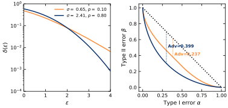
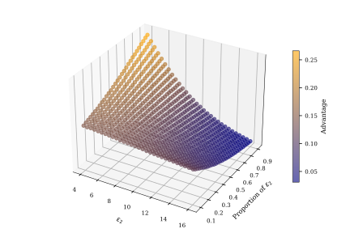
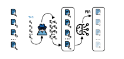
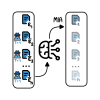
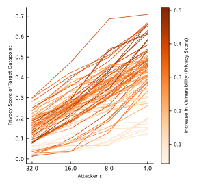
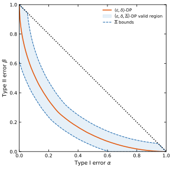

# Your Privacy Depends on Others: Collusion Vulnerabilities in Individual Differential Privacy

[](https://arxiv.org/abs/2401.XXXXX)
[](https://www.python.org/downloads/)
[](https://opensource.org/licenses/MIT)
[](https://satml.org/)

Official implementation of **"Your Privacy Depends on Others: Collusion Vulnerabilities in Individual Differential Privacy"** accepted at **IEEE SaTML 2026**.

**Authors:** Johannes Kaiser<sup>1</sup>, Alexander Ziller<sup>1</sup>, Eleni Triantafillou<sup>1</sup>, Daniel Rückert<sup>1,2</sup>, Georgios Kaissis<sup>1,3</sup>

<sup>1</sup>Technical University of Munich (TUM) | <sup>2</sup>Helmholtz Center Munich | <sup>3</sup>Imperial College London


## Overview

Individual Differential Privacy (iDP) promises users control over their privacy through **personalized privacy budgets**. However, we reveal a critical vulnerability:

> **In sampling-based iDP mechanisms, your privacy risk depends not just on your own budget choice, but on everyone else's choices too.**

### The Core Vulnerability

Sampling-based iDP mechanisms adjust per-sample sampling rates to meet individual privacy budgets. However:

1. **Privacy Interdependence**: To maintain fixed batch sizes, if some users choose strict budgets (low sampling rates), others must have higher sampling rates
2. **Incomplete Specification**: Mechanisms are calibrated only to a single (ε, δ) point, leaving the full privacy profile unconstrained
3. **Exploitable Gaps**: Different mechanisms with identical (ε, δ) can expose users to vastly different real-world risks

<p align="center">
  
  <br>
  <em><strong>Figure 1:</strong> Privacy profiles and adversarial advantage of mechanisms calibrated to (2, 0.08)-DP show vastly different protections despite identical (ε, δ) guarantees.</em>
</p>

<p align="center">
  
  <br>
  <em><strong>Figure 2:</strong> Vulnerability of one group of datapoints in the presence of another group across different proportions and privacy budgets.</em>
</p>

### Key Findings

We demonstrate that:
- 🔍 **Privacy interdependencies** create exploitable attack vectors between users
- ⚔️ **Adversaries can manipulate budgets** to increase targeted individuals' vulnerability
- 📊 **62% success rate** in targeted attacks across diverse datasets
- 🛡️ **Proposed mitigation** (εᵢ, δᵢ, Δ)-iDP bounds excess vulnerabilities

## Attacks & Vulnerabilities

### 1. Budget Manipulation Attack

A central adversary (e.g., model trainer) strategically assigns privacy budgets within contractual limits to maximize a target's vulnerability.

**Attack Model:**
- Adversary controls budget distribution across users
- Operates entirely within DP's formal guarantees
- Exploits privacy co-dependencies to increase sampling rates for targets

<p align="center">
  
  <br>
  <em><strong>Figure 3:</strong> Budget manipulation attack framework showing how adversarial budget assignment increases target vulnerability.</em>
</p>

### 2. Collusion Attack

Multiple data contributors coordinate their privacy budget choices to increase a victim's risk—**no central authority needed**.

**Attack Model:**
- Distributed participants coordinate budget choices
- Colluders choose low budgets (low sampling rates)
- Forces targets to higher sampling rates, increasing vulnerability

<p align="center">
  
  <br>
  <em><strong>Figure 4:</strong> Collusion attack showing how coordinated budget choices exploit system-level dependencies.</em>
</p>

## Empirical Results

### Attack Success Rates

<p align="center">
  
  <br>
  <em><strong>Figure 5:</strong> Privacy score increases for targeted individuals in budget manipulation attacks. <strong>62% of targeted samples</strong> show significantly increased vulnerability.</em>
</p>

## Installation & Setup

### Prerequisites
- Python 3.9+
- CUDA 11.8+ (optional, for GPU acceleration)
- ~20GB disk space for datasets

### Quick Start

```bash
# 1. Clone the repository
git clone https://github.com/Johannes-Kaiser/Clipping_vs_Sampling.git
cd Clipping_vs_Sampling

# 2. Create and activate conda environment
conda create -n idp-vuln python=3.9
conda activate idp-vuln

# 3. Install dependencies
pip install -r requirements.txt
```

### Dependencies

Key packages:
- **PyTorch** (≥2.0) - Model training and inference
- **Opacus** (custom fork) - Differential privacy mechanisms making use of fast DP computations and allowing for iDP
- **DP** (custom fork) - Fast DP computations


## Repository Structure

```
Clipping_vs_sampling/
├── experiment_scripts/                       # Experimental code
│   ├── README.md                              # Detailed guide to experiments
│   ├── mia/
│   │   ├── 01_budget_control_adv.py          # Budget manipulation attack (main)
│   │   ├── 02_eval_mia_across_runs_clean.py  # Multi-seed evaluation
│   │   ├── 03_eval_mia_post.py               # Statistical analysis
│   │   ├── 04_mia.py                         # Core MIA (LiRA)
│   │   ├── exp_yaml/                         # Dataset configurations
│   │   │   ├── credit_card_default.yaml      # Tabular: Credit card
│   │   │   ├── adult.yaml, german_credit.yaml # Other tabular
│   │   │   ├── mnist.yaml, cifar10.yaml      # Vision datasets
│   │   │   └── *mnist*.yaml                  # Medical datasets
│   │   ├── utils/
│   │   │   ├── utils_general.py              # Dataset loading, models
│   │   │   └── utils_mia.py                  # LiRA attack
│   │   └── *.ipynb                           # Evaluation notebooks
│   └── ...
├── notebook_scripts/                                   # Analysis & visualization
│   ├── README.md                              # Notebook guide
│   ├── plot_bound.ipynb                       # Theoretical bounds
│   ├── 00_clipping_vs_sampling_using_opacus.ipynb # Mechanism comparison
│   ├── 01_plot_teaser.ipynb                   # Teaser figure
│   ├── 02_generate_example_figs.ipynb          # Publication figures
│   ├── 03_3D_plot_budg_portion_adv.ipynb       # 3D visualizations
│   ├── 04_plot_Delta_bound.ipynb               # Theoretical bounds
│   ├── 05_independence_of_batche_size.ipynb    # Batch size analysis
│   └── 06_effect_of_larger_delta.ipynb         # Delta parameter analysis
├── opacus_new/                                # Modified Opacus library
│   ├── privacy_engine.py                      # iDP with per-sample budgets
│   ├── accountants/                           # Privacy accounting
│   └── ...
```


## Quick Start: Running Experiments

### Experiment 1: Budget Manipulation Attack (Main Results)

Reproduce the main attack from Table I:

```bash

# Test on Credit Card Default dataset
cd scripts_experiments/mia
python ./experiment_scripts/mia/budget_control_adv.py \
        --exp_yaml ./experiment_scripts/mia/exp_yaml_adv/adult.yaml \
        --idx_start 1 --idx_end 100 &
```

### Experiment 2: Evaluate Attacks Across Multiple Runs

```bash
# Evaluate MIA effectiveness across different seeds
python 02_eval_mia_across_runs_clean.py \
    --savedir ./budget_adv_final_by_dataset \
    --dataset credit_card_default \
    --seeds 0 1 2 3 4

# Generate statistics and plots
python 03_eval_mia_post.py \
    --results_dir ./budget_adv_final_by_dataset
```


## Proposed Solution: (εᵢ, δᵢ, Δ)-iDP

We propose extending the iDP contract to include a **Δ-divergence bound** that limits excess vulnerability:

### Concept

Standard iDP only guarantees individual (ε, δ) at a single point. We propose adding a constraint Δ that bounds how much an individual's privacy can degrade due to others' budget choices.

### Key Properties

- **Individually controlled**: Each user specifies their (εᵢ, δᵢ, Δᵢ) contract
- **System-level guarantee**: Mechanism rejects parameter choices violating Δ bounds
- **Backward compatible**: Reduces to standard iDP when Δ → 0

### Visual Comparison

<p align="center">
  
  <br>
  <em><strong>Figure 6:</strong> Valid parameter region for (8, 10⁻⁵, 0.05)-DP showing how Δ-bounds restrict excess vulnerability.</em>
</p>

