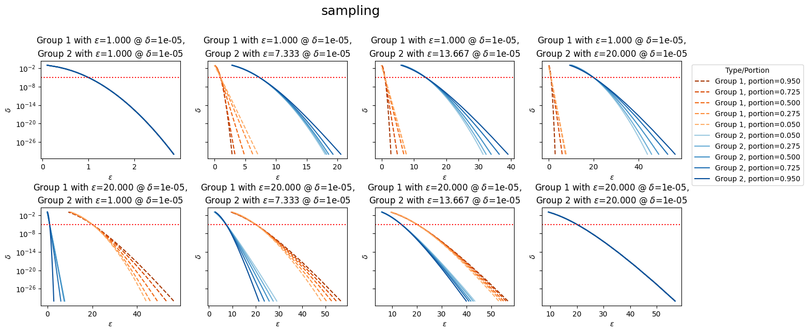
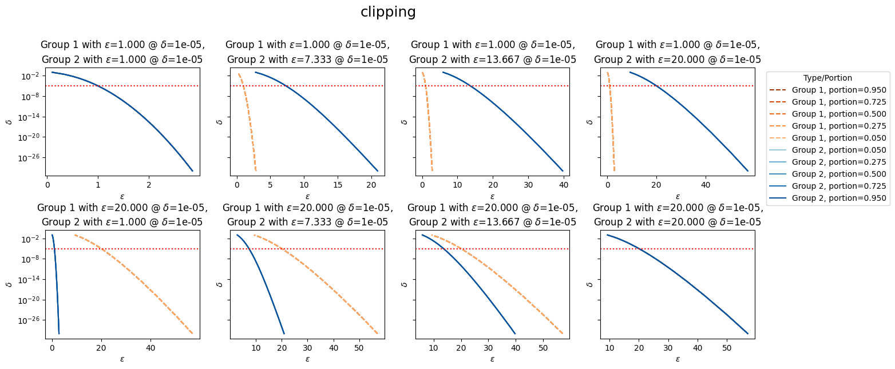

# Evaluating Individual Differential Privacy (iDP)

This document presents an evaluation of individual differential privacy (iDP) in the context of clipping and sampling settings.

Todos:
* Still heavily RDP based
* Empirically evaluate how this behaves with increasing number of iterations

## Experimental Results

The following image illustrates results from our experiments:

